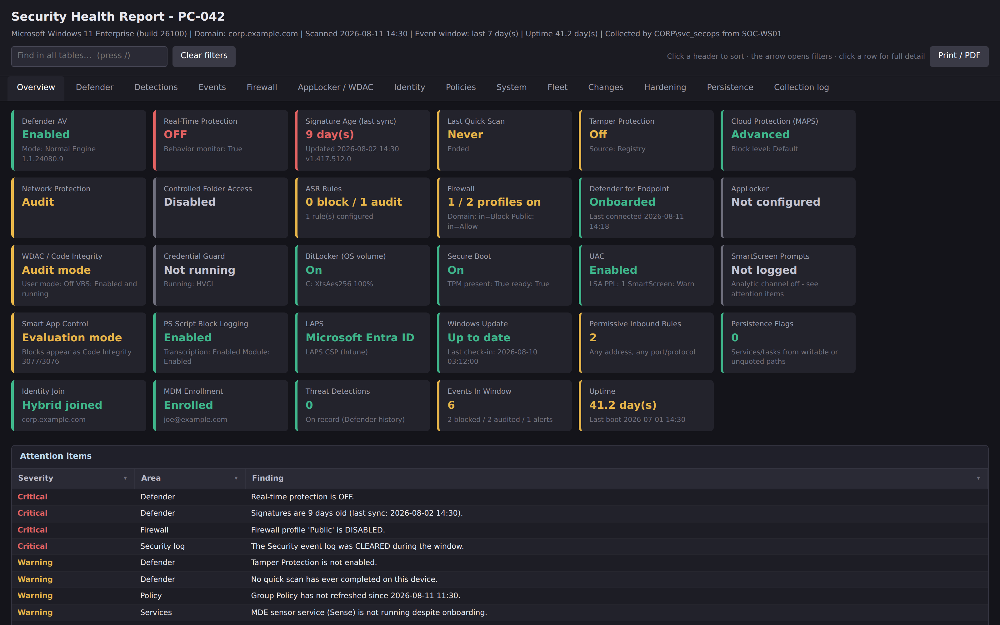
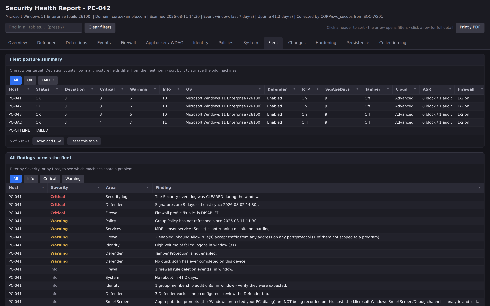
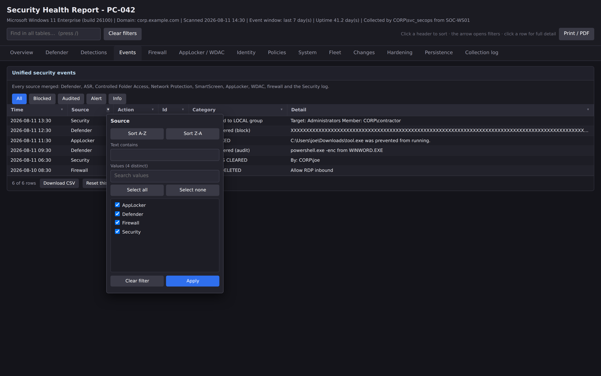
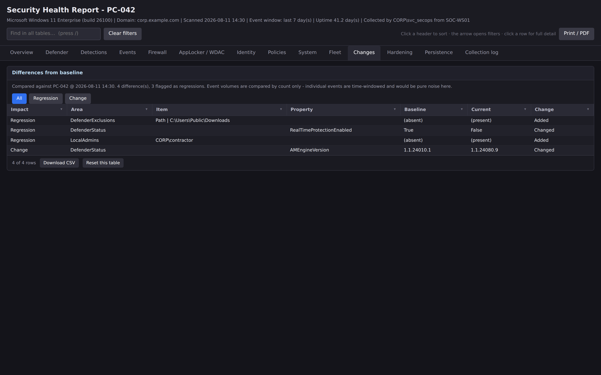
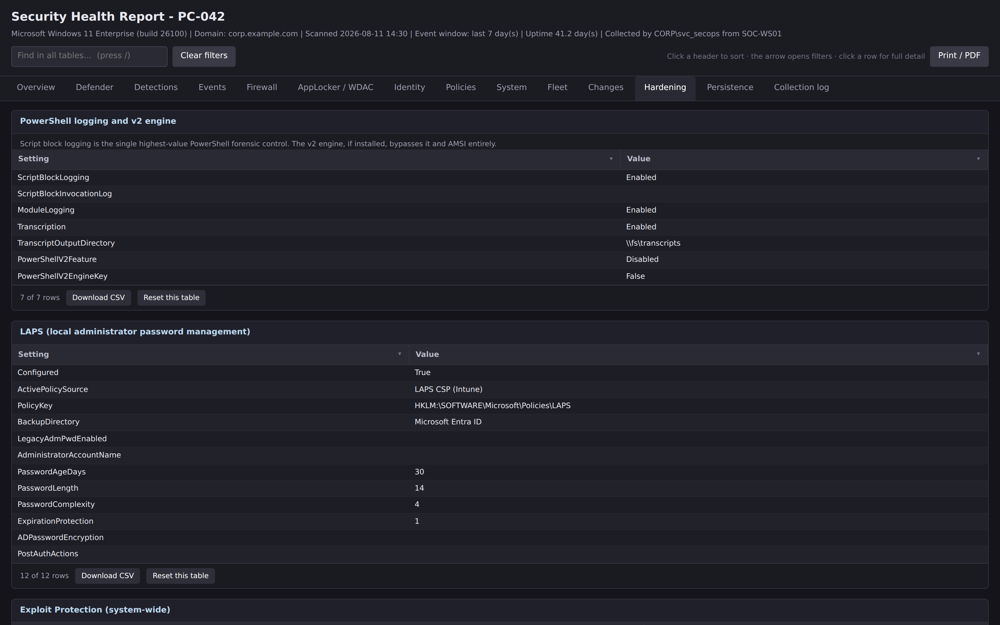
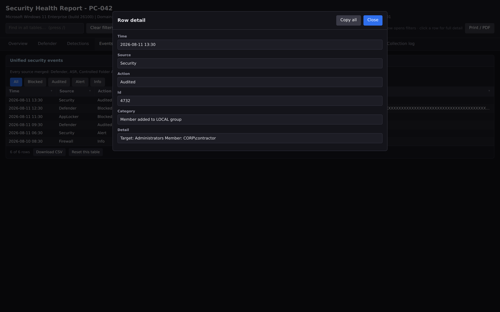
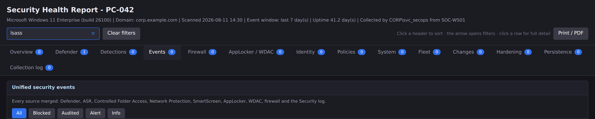

# Windows Security Health Dashboard

[](https://github.com/JosephMcEvoy/windows-security-health-dashboard/actions/workflows/ci.yml)
[](https://github.com/JosephMcEvoy/windows-security-health-dashboard/actions/workflows/security.yml)
[](LICENSE)
[](https://learn.microsoft.com/powershell/)
[](https://www.powershellgallery.com/packages/SecurityHealthDashboard)

Point it at a Windows machine and get one answer to the question *"what is
actually going on with security on this box?"* — what is blocking, what is
merely auditing, what silently is not running at all.

One read-only PowerShell script. No agent, no module to install, no internet
access needed at scan time. It connects over WinRM, reads native Microsoft
security tooling, and renders a WPF dashboard plus a self-contained interactive
HTML report you can attach to a ticket.



---

## Why this exists

Windows security state is scattered across a dozen places that do not talk to
each other. Defender's mode lives in `Get-MpComputerStatus`, its ASR rules in
`Get-MpPreference`, the blocks those rules produced in an operational event log,
AppLocker's verdicts in three more logs, WDAC's in another, SmartScreen's in a
channel that **is switched off by default**, and the identity context that makes
any of it meaningful in `dsregcmd` and the Security log.

Answering "why was this blocked?" or "is this machine actually protected?" means
visiting all of them. This tool visits them once, in parallel, and puts the
result in one place — including, crucially, telling you when a source was not
being recorded, so an empty table never reads as good news.

## What it collects

| Area | What you get |
|---|---|
| **Defender antivirus** | Running mode (including passive), real-time protection, tamper protection, engine/platform/signature versions, last signature sync, scan history, cloud (MAPS) level, PUA, exclusions |
| **Attack Surface Reduction** | Every rule by name with its mode — Block, Audit, Warn or Disabled — and the blocks and audits they produced |
| **Defender events** | Detections, remediations, Controlled Folder Access, Network Protection, config changes, tamper-protection blocks |
| **SmartScreen** | App-reputation prompts (the *"Windows protected your PC"* dialog) — **and whether that channel is even being recorded**, because it is disabled by default |
| **Smart App Control** | Off / Evaluation / Enforcement, with a pointer to the Code Integrity events its blocks appear as |
| **Firewall** | Profile state, default actions, rule counts, rule changes, blocked connections, and inbound Allow rules open to any address on any port |
| **AppLocker / WDAC** | Effective enforcement per rule collection, allowed/audited/blocked events, Code Integrity 3076/3077, VBS, HVCI, Credential Guard |
| **Identity** | Domain and Entra join state, secure channel health, local admins, local users, active sessions, logon summary, failed logons, group and audit-policy changes, log-cleared alerts |
| **Hardening** | PowerShell script-block / module / transcription logging, the PowerShell 2.0 engine, LAPS, system Exploit Protection, update currency and pending reboots |
| **Persistence** | Services and non-Microsoft scheduled tasks launching from user-writable or unquoted paths |
| **Policy** | Applied GPOs, last refresh, MDM enrolment, effective audit policy, BitLocker, Secure Boot, TPM, LSA protection, UAC |

Everything is turned into a ranked list of **attention items** — Critical,
Warning, Info — so you are not left reading raw tables to find the problem.

## Screenshots

<table>
<tr>
<td width="50%"><a href="docs/screenshots/report-fleet.png"></a><br><sub><b>Fleet view.</b> One row per host. <i>Deviation</i> counts how many posture fields differ from the fleet norm — sort by it and the odd machines float to the top.</sub></td>
<td width="50%"><a href="docs/screenshots/report-events-filter.png"></a><br><sub><b>Unified events.</b> Every source merged into one Blocked / Audited / Allowed stream, with per-column filters and one-click action chips.</sub></td>
</tr>
<tr>
<td width="50%"><a href="docs/screenshots/report-changes.png"></a><br><sub><b>Baseline diff.</b> What changed since the last scan, with security regressions flagged and sorted first.</sub></td>
<td width="50%"><a href="docs/screenshots/report-hardening.png"></a><br><sub><b>Hardening.</b> PowerShell logging, the v2 engine bypass, LAPS, Exploit Protection and patch currency.</sub></td>
</tr>
<tr>
<td width="50%"><a href="docs/screenshots/report-row-detail.png"></a><br><sub><b>Row detail.</b> Click any row for the full, untruncated record.</sub></td>
<td width="50%"><a href="docs/screenshots/report-find.png"></a><br><sub><b>Global find.</b> Searches every column of every table on every tab, with per-tab match counts.</sub></td>
</tr>
</table>

## Quick start

```powershell
# From the PowerShell Gallery - lands in your user Scripts folder, which is on PATH
Install-Script SecurityHealthDashboard -Scope CurrentUser
SecurityHealthDashboard.ps1
```

Would rather install nothing? Take the single `.ps1` from
[Releases](https://github.com/JosephMcEvoy/windows-security-health-dashboard/releases)
and run it in place — every example below works either way. The file published
to the Gallery is byte-identical to the release asset, so the release's
`SHA256SUMS.txt` verifies both, and CI asserts that on every pull request.

```powershell
# Scan one machine, interactively
.\src\SecurityHealthDashboard.ps1

# Or go straight at a target
.\src\SecurityHealthDashboard.ps1 -ComputerName PC-042 -LookbackDays 14
```

Type a name, press **Scan**, then **Export HTML report** when you want something
to attach to a ticket.

### Requirements

| | |
|---|---|
| **Operator workstation** | Windows PowerShell 5.1+ (or PowerShell 7 on Windows). WPF is needed for the GUI, but **not** for `-Quiet`. |
| **Target** | WinRM enabled (`Enable-PSRemoting`), and you need to be an administrator on it. |
| **Network** | TCP 5985 (or 5986). |
| **Workgroup targets** | Add to `TrustedHosts` and use `-Credential`. |

Targeting `localhost` or `.` collects locally and skips WinRM entirely.

## Common recipes

```powershell
# Reuse one admin credential for a whole triage session
$cred = Get-Credential CORP\svc_secops
.\src\SecurityHealthDashboard.ps1 -ComputerName PC-042 -Credential $cred

# A bare user name works too - it prompts for the password
.\src\SecurityHealthDashboard.ps1 -ComputerName WKGRP-BOX -Credential .\LocalAdmin

# Fleet triage: several machines at once
.\src\SecurityHealthDashboard.ps1 -ComputerName PC-041,PC-042,PC-043 -Throttle 12

# Compare a suspect machine against a known-good golden image
.\src\SecurityHealthDashboard.ps1 -ComputerName PC-042 -BaselinePath .\golden.json

# Unattended: no GUI, write reports to a share, act on the exit code
.\src\SecurityHealthDashboard.ps1 -Quiet -TargetFile .\examples\workstations.txt `
    -OutputPath \\fileserver\SecReports -Throttle 16
if ($LASTEXITCODE -ge 2) { "Escalate - critical findings or regressions" }
```

### Exit codes (`-Quiet`)

| Code | Meaning |
|---|---|
| `0` | Everything scanned, nothing above Info |
| `1` | At least one Warning finding |
| `2` | At least one Critical finding, or a regression against the baseline |
| `3` | At least one target could not be scanned |

`3` outranks the severities deliberately: a monitoring job that silently lost a
host is worse than one that found problems.

### Run it weekly

```powershell
$ps  = 'C:\Windows\System32\WindowsPowerShell\v1.0\powershell.exe'
$arg = '-NoProfile -ExecutionPolicy Bypass -File "C:\Tools\SecurityHealthDashboard.ps1" ' +
       '-Quiet -TargetFile "C:\Tools\workstations.txt" -OutputPath "\\fileserver\SecReports" ' +
       '-BaselinePath "C:\Tools\golden.json" -Throttle 16'

Register-ScheduledTask -TaskName 'Security Health Weekly' `
    -Action    (New-ScheduledTaskAction -Execute $ps -Argument $arg) `
    -Trigger   (New-ScheduledTaskTrigger -Weekly -DaysOfWeek Monday -At 6am) `
    -Principal (New-ScheduledTaskPrincipal -UserId 'CORP\svc_secops' `
                    -LogonType Password -RunLevel Highest)
```

Task Scheduler surfaces the exit code as **Last Run Result**, so a second task
triggered on Event ID 201 can mail or push when it is non-zero.

## Design decisions worth knowing

**It is read-only.** The collector never changes anything on a target. That is
what makes it safe to hand to a junior tech and point at production. A CI
contract test fails the build if a state-changing cmdlet appears in `src/`.

**"Not logged" is never rendered as "nothing happened."** Several Windows
sources are off by default — SmartScreen's app-reputation channel is analytic
and disabled, Filtering Platform connection auditing is usually off. The tool
checks whether each source is *recording* before reporting on it, and says so
plainly, with the command to turn it on. An empty table that looks reassuring is
the most dangerous output a tool like this can produce.

**Credentials stay in memory.** Never written to disk, never on a command line,
never in a report. Only the user name is recorded, as scan provenance — and only
when the credential was genuinely used (a local scan records the interactive
user, because that is what actually ran).

**The report is self-contained.** No CDN, no fonts, no telemetry, no callbacks.
One HTML file that works from a file share, an email attachment, or an air-gapped
jump box. Roughly 40–60 KB.

**One file, in-box cmdlets only.** You copy a single `.ps1` to a jump box. There
is nothing to install on the target, which matters when the target is the machine
you are worried about.

## Repository layout

```
src/SecurityHealthDashboard.ps1   the tool - one self-contained script
build/                            static checks, gallery rehearsal, sample report
tests/                            Pester unit + contract tests
tests/browser/                    Playwright tests for the HTML report
docs/screenshots/                 images used above
examples/                         a sample -TargetFile list
.github/workflows/                CI, security, release
```

## Development

```powershell
./build/Invoke-StaticChecks.ps1                  # structural guards
Invoke-Pester ./tests                            # unit + contract tests
./build/Test-GalleryPublish.ps1                  # rehearse the Gallery publish
./build/New-SampleReport.ps1 -Fleet -OutputPath ./sample.html
```

The tests are worth a look even if you never contribute: most of them exist
because that exact bug shipped once, and each has a comment explaining what
went wrong. Highlights include a `[Credential()]` attribute that hung headless
runs by prompting on a console nobody was watching, and a snapshot format that
reported 63 differences when a scan was compared against *itself*.

### Contributing

Bug reports, collectors and better findings are all welcome. Please read
[CONTRIBUTING.md](CONTRIBUTING.md) first — it explains the PR process, what gets
merged easily, and the handful of house rules that are enforced in CI (and why
each one exists).

The short version:

1. Open an issue first for anything non-trivial.
2. Fork, branch off `main`, one logical change per PR.
3. Run `./build/Invoke-StaticChecks.ps1` and `Invoke-Pester ./tests` locally.
4. Add a test that fails before your fix and passes after.
5. Open the PR, fill in the template, and make CI green.

### Reporting a security problem

**Do not open a public issue.** Use
[GitHub Security Advisories](https://github.com/JosephMcEvoy/windows-security-health-dashboard/security/advisories/new)
(repository → **Security** → **Advisories** → **Report a vulnerability**) for a
private thread with the maintainers.

[SECURITY.md](SECURITY.md) sets out what is in scope — including report XSS,
credential exposure, and any change that makes the tool write to a target — what
is not, and what response times to expect.

## Caveats

- **Scan output describes a machine's security posture**, so reports and
  snapshots contain host names, account names, IPs and event detail. The
  `.gitignore` deliberately excludes them. Treat them like any other sensitive
  operational artefact.
- SmartScreen app-reputation events only cover GUI-initiated launches. Anything
  started from `powershell` or `cmd` bypasses the shell's reputation check.
- Some collectors need elevation on the target. Remoting as an administrator
  covers it; if something could not be read it appears in the Collection log
  rather than failing the scan.
- The fleet HTML index carries the fleet summary and all findings, not every
  host's full detail — per-host reports stay separate files so the index stays a
  sensible size.

## Licence

[MIT](LICENSE).
